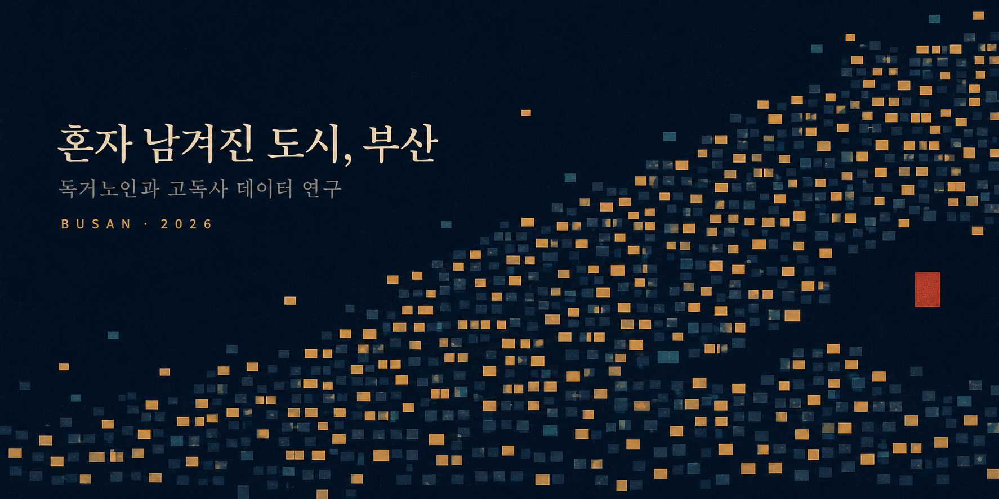

<div align="center">
  
</div>

# 혼자 남겨진 도시, 부산

전국에서 가장 먼저 초고령사회에 들어선 도시의 독거노인·고독사 데이터를 다룬 연구 발표 웹앱.

**부산정보영재교육원 중학교 2학년** · 김동윤 · 박찬우 · 이연우 · 이선호

---

## 이 프로젝트의 규칙

> **가설이 틀리면 틀렸다고 쓴다.**

판정은 화면이 아니라 코드가 내립니다. [`src/lib/hypothesis.ts`](src/lib/hypothesis.ts) 의 순수 함수가 CSV 를 읽어
채택 / 부분채택 / 기각 / 검증불가를 계산하고, 화면은 그 결과를 그리기만 합니다. 데이터를 갱신하면 발표
마지막 장의 결론도 자동으로 바뀝니다. 결론을 먼저 정해 놓고 데이터를 맞추지 않으려고 이렇게 만들었습니다.

## 판정 기준을 먼저 등록했습니다

판정 기준은 데이터를 보기 전인 2일차(7.18) 연구계획서에 적어 두고, 코드에 상수로 박았습니다
([`H1_CRITERION`](src/lib/hypothesis.ts)). 결과를 보고 기준을 고치면 검증이 아니라 변명이기 때문입니다.

> **H1 기준** — 2019년부터의 연평균 증가율을 부산과 전국에서 비교해, 부산이 **1%p 이상** 높은 축만 '충족'으로 센다.

이 기준을 지킨 대가로 H1 은 채택이 아니라 **부분채택**이 됐습니다.

## 가설과 판정 (현재 데이터 기준)

| | 가설 | 판정 | 근거 |
|---|---|---|---|
| **H1** | 부산은 전국보다 더 가파르게 고립되는가 | **부분채택** | 2019→2024 연평균 증가율 — 독거노인 8.46% vs 8.35%(격차 **0.11%p 미달**) · 고독사 7.64% vs 5.88%(격차 **1.76%p 충족**) |
| **H2** | 어디가 가장 외로운가 | **채택** | 2024년 독거노인 비율 원도심 5개구 27.8% vs 나머지 23.0% · 원도심 정의를 바꿔도 유지(6.2%p / 5.2%p) |
| **H3** | 누가 혼자 떠나는가 | **검증불가** | 부산의 성별×연령 고독사 교차표 미공표. 추정치를 만들지 않고 그 칸을 비워 뒀다 |

**세 개 중 온전히 채택된 것은 하나뿐입니다.** 저희는 이것을 실패가 아니라 결과로 봅니다.

H1 이 반만 맞았다는 사실이 이 연구에서 가장 중요한 발견입니다. 부산의 독거노인은 전국보다 빠르게 늘지만
그 격차는 0.11%p 로, 독거노인 증가는 부산만의 일이 아니라 전국이 함께 겪는 흐름이었습니다.
부산이 뚜렷하게 앞선 것은 고독사 쪽(1.76%p)이었습니다. 문제는 '혼자 사는 노인이 유난히 빨리 느는 것'이
아니라 **'혼자 사는 것이 혼자 죽는 일로 이어지는 속도'** 였습니다.

## 구성

| 챕터 | 내용 |
|---|---|
| 0 | **창문** — 사각형 1개 = 독거노인 1,000가구. 부산의 밤이 하나씩 켜진다 |
| 1 | **H1** 지수 추세 — 첫 연도를 100으로 놓고 '수준'이 아니라 '속도'를 본다 |
| 2 | **H2** 코로플레스 지도 + 산점도 — 16개 구·군을 하나씩 켠다 |
| 3 | **H3** 인구 피라미드 — 전국 고독사 옆에 부산 독거 구조를 병치한다 |
| 4 | **우리 가족의 거리** — 여기서 배경이 종이색으로 바뀐다. 같은 숫자를 관람객의 좌표 위에 다시 놓는다 |
| 5 | **그래서 지금 무엇을 할 수 있나** — 공식 사이트에서 확인한 제도만 |
| 6 | **연구 노트** — 판정 요약, 만든 과정, 못 한 것 전부 |

## 실행

```bash
npm install
npm run dev        # http://localhost:5173
npm test           # 가설 판정 함수 테스트 18개
npm run build      # dist/ 생성
npm run preview    # 빌드 결과를 로컬 서버로 확인 (발표는 이 방식으로)
```

데이터를 다시 만들려면:

```bash
npm run data:fetch   # 행안부 CSV + KOSIS OpenAPI 원본 → _raw/  (.env 의 KOSIS_API_KEY 필요)
npm run data:build   # 원본 → public/data/*.csv, *.geojson
```

보건복지부 고독사 수치만 API 가 없어 보도자료 원문에서 전사했습니다.
`scripts/build_csv.mjs` 상단 상수를 직접 고쳐야 합니다.

## 발표 모드

`P` 키를 누르거나 주소에 `?present=1` 을 붙이면 켜집니다.

- 글자가 1.25배 커집니다 (프로젝터 뒷줄까지)
- `←` `→` 로 챕터 이동, `Home` / `End` 로 처음·끝, `Esc` 로 나가기
- 폰트 206개를 로컬에 번들해 뒀습니다. 발표장 와이파이가 없어도 글꼴이 깨지지 않습니다

## 이 연구가 못 한 것

1. 주택총조사 공표 구간이 `1979년 이전 / 1980~1989 / 1990~1999` 뿐이라 **"30년 이상"을 계산할 수 없었다.** 1989년 이전 준공(2024년 기준 35년 이상)으로 대신했다.
2. 독거노인 비율은 **분자가 인구총조사, 분모가 주민등록**이라 조사 기준이 섞여 있다.
3. **부산의 성별×연령 고독사 교차표가 공표되지 않는다.** H3 이 검증불가인 이유다.
4. 독거노인 2011~2014년은 인구총조사가 없어 **값이 비어 있다.** 메우지 않고 비운 채로 뒀다.
5. **상관관계는 인과관계가 아니다.**
6. 인구소멸위험지수는 원자료로 대조하지 못해 **넣지 않았다.**

전부 화면(Chapter 6)에도 적혀 있습니다. 질문받기 전에 먼저 말하기로 했습니다.

## 데이터 출처

행정안전부 주민등록 인구통계 · 국가데이터처(통계청) 인구총조사 / 주택총조사 · 보건복지부 고독사 실태조사 ·
통계청 센서스용 행정구역경계. 전체 목록과 링크는 [`public/data/sources.json`](public/data/sources.json) 과
화면 Chapter 6 에 있습니다.

Chapter 5 의 제도 정보는 각 기관 공식 사이트에서 직접 확인했고, 확인일과 URL 을
[`src/data/programs.ts`](src/data/programs.ts) 에 함께 적어 뒀습니다. **제도는 바뀝니다. 발표 전에 다시 확인하세요.**

## 만든 것

Vite · React 18 · TypeScript · Tailwind CSS · framer-motion · zod · d3-geo · vitest
